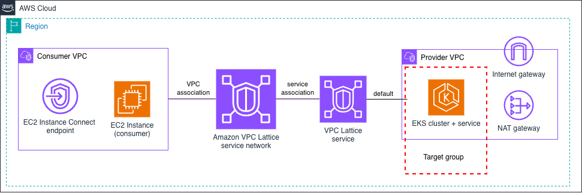

# Amazon VPC Lattice - Amazon EKS Target

This pattern demonstrates publishing an HTTP/HTTPS service backed by a workload on **Amazon EKS** through VPC Lattice, using the **IP** target type and the **AWS Gateway API Controller**. You author standard Kubernetes [Gateway API](https://gateway-api.sigs.k8s.io/) resources (`Gateway`, `HTTPRoute`) and the controller registers the EKS pods as IP targets. Both the consumer and provider VPCs intentionally use the same address space (`10.0.0.0/16`) to make the overlapping-CIDR benefit explicit.



From the consumer EC2 instance, the service's DNS name resolves to a VPC Lattice **link-local** address (`169.254.171.x`); the request is then brokered by VPC Lattice to a healthy EKS pod.

## What gets deployed

| Component | Details |
|-----------|---------|
| **Consumer VPC** (`10.0.0.0/16`) | EC2 instances (1 per AZ) with an EC2 Instance Connect endpoint; associated to the service network |
| **Provider VPC** (`10.0.0.0/16`) | EKS **Auto Mode** cluster on **Graviton** (arm64) nodes, with a NAT gateway per AZ for egress |
| **ECR Repository** | Amazon ECR repository for the sample app image |
| **AWS Gateway API Controller** | Installed via Helm; reconciles the Gateway API objects into VPC Lattice resources (authenticated with EKS Pod Identity) |
| **VPC Lattice service network** | Terraform-owned; the controller binds to it rather than creating its own |
| **Target group** | 1 **IP** type target group — the EKS pods, registered by the controller |
| **VPC Lattice service** | 1 service with an HTTPS listener forwarding to the pods |
| **Access logging** | A CloudWatch Logs log group (`/aws/vpclattice/<identifier>`) and an access log subscription at the service-network scope |

## VPC Lattice service configuration

| Aspect | Configuration |
|--------|---------------|
| **Custom Domain Name** | ❌ No (uses VPC Lattice-generated FQDN) |
| **Certificate** | ✅ VPC Lattice-managed (auto-generated for the generated domain) |
| **Listener** | HTTPS on port 443 |
| **Target Group** | IP type |
| **Routing** | 100% traffic to the EKS pods |
| **Targets** | EKS pods (registered by the AWS Gateway API Controller) |
| **Backend Protocol** | HTTP on port 80 |

## Implementation

This pattern is **Terraform-only**. The implementation directory has its own README with deployment instructions:

| IaC Tool | Location |
|----------|----------|
| **Terraform** | [`./terraform/`](./terraform/) |
| **CloudFormation** | Not provided — see below|

Unlike the other architecture patterns in this section, EKS ships **Terraform only**. The AWS Gateway API Controller is a **Helm chart** driven by **Kubernetes Custom Resources** (the Gateway API CRDs), reconciled inside the cluster; neither has a clean CloudFormation representation (both would need custom resources shelling out to `helm`/`kubectl`). Terraform installs the chart and applies the manifests natively, in the same dependency graph as the AWS resources.

This is the single declared exception to the repository's [IaC parity policy](../../../README.md#patterns).

## Testing Connectivity

After deploying, you connect to a consumer EC2 instance, resolve the service's DNS name through VPC Lattice (it returns a link-local `169.254.171.x` address), and `curl` the service to confirm HTTPS-over-Lattice connectivity to the EKS pods — across two VPCs that both use `10.0.0.0/16`, with no VPC peering or transit gateway.

<details>
<summary>Click to expand testing steps</summary>

#### Step 1: Connect to Consumer Instance

> **Note**: Consumer EC2 instance IDs are provided as the `consumer_instance_ids` output. Point `kubectl` at the cluster first using the `configure_kubectl` output.

```bash
aws ec2-instance-connect ssh --instance-id <consumer-instance-id>
```

#### Step 2: Test DNS Resolution

> **Note**: The controller assigns the service domain name — read it from the cluster (it is not a Terraform output):
> ```bash
> kubectl get httproute sample-service -n vpc-lattice-demo \
>   -o jsonpath='{.metadata.annotations.application-networking\.k8s\.aws/lattice-assigned-domain-name}'
> ```

```bash
dig <service-domain-name>
```

**Expected Result**: Link-local address (169.254.171.X) indicating VPC Lattice routing

#### Step 3: Test HTTPS Connectivity

```bash
curl https://<service-domain-name>
```

**Expected Response** (JSON format):
```json
{
  "message": "Hello from Amazon EKS!!",
  "request_ip": "169.254.171.X"
}
```

#### Step 4: Verify Target Health

1. Navigate to **VPC → VPC Lattice → Target groups**
2. Select the IP type target group the controller created
3. Verify the EKS pod IPs show **"Healthy"** status

</details>

## Cleanup

Tear down the resources when you are finished to stop incurring charges. While deployed it runs an EKS Auto Mode cluster, NAT gateways, and consumer EC2 instances, plus CloudWatch Logs vended-logs pricing for VPC Lattice access logging.

| IaC Tool | From | Command |
|----------|------|---------|
| **Terraform** | [`./terraform/`](./terraform/) | `terraform destroy` |

> The controller-created VPC Lattice service/target group are removed automatically when Terraform deletes the `Gateway`/`HTTPRoute`. See the [Terraform README cleanup](./terraform/#cleanup) for the teardown-ordering note.

## Next Steps

After successfully deploying this pattern:

1. **Test connectivity**: Follow the testing guide above to verify the service works correctly.
2. **Explore other targets**: Try [EC2 Instance](../1-ec2_instance/), [Auto Scaling Group](../2-auto_scaling_group/), [Lambda](../3-lambda_function/), [ECS](../4-ecs/), or [RDS / VPC Resources](../6-rds/) patterns.
3. **Restrict access**: This pattern already enables `AWS_IAM` auth with an open policy. See the [Auth Policies & SigV4 toolkit](../../4-auth_policies/) to swap in a restrictive policy and sign requests with SigV4.
4. **Multi-Account**: Move to [Multi-Account patterns](../../2-multi_account/) for cross-account deployments.
5. **Advanced architectures**: Explore [Advanced patterns](../../3-advanced_architectures/) for more complex scenarios.
