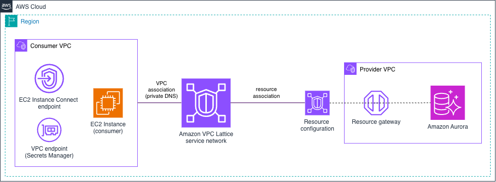

# Amazon VPC Lattice - Amazon RDS (Aurora) VPC Resource

This pattern demonstrates the **VPC Lattice VPC Resources** (resource gateway) model: consuming a native AWS TCP resource (an Amazon Aurora (MySQL) cluster) through VPC Lattice. Both the consumer and provider VPCs intentionally use the same address space (`10.0.0.0/16`) to make the overlapping-CIDR benefit explicit. This pattern targets a **native AWS resource over raw TCP** (MySQL on port 3306) using a VPC Lattice **resource gateway** and **resource configuration**. It is the reference for "I need to reach a database / TCP endpoint in another VPC through Lattice".



From the consumer EC2 instance, the Aurora endpoint resolves to a VPC Lattice-managed address (IPv4 `129.224.0.x/17`, IPv6 `fd00:ec2:80::/64`); the MySQL client then connects to Aurora over TCP through VPC Lattice using the credentials stored in Secrets Manager.

## What gets deployed

| Component | Details |
|-----------|---------|
| **Provider VPC** (`10.0.0.0/16`) | Resource-gateway subnet tier + database subnet tier across the configured Availability Zones |
| **Amazon Aurora MySQL cluster** | `aurora-mysql` cluster + instance; primary credentials **managed by RDS in AWS Secrets Manager** (`manage_master_user_password` / `ManageMasterUserPassword`) — no password is ever defined in code |
| **VPC Lattice resource gateway** | DUALSTACK, deployed into the provider VPC's resource-gateway subnets |
| **VPC Lattice resource configuration** | `type = ARN`, pointing at the Aurora cluster ARN |
| **VPC Lattice service network** | The resource configuration is associated to it |
| **Consumer VPC** (`10.0.0.0/16`) | Associated to the service network with private DNS enabled (`ALL_DOMAINS`), plus a **consumer EC2 instance** (with a scoped IAM role to read the RDS-managed secret) used to run the connectivity tests, and a **Secrets Manager interface VPC endpoint** so the instance can read the secret privately |
| **Access logging** | A CloudWatch Logs log group (`/aws/vpclattice/<identifier>`) and an access log subscription at the service-network scope |
| **Security groups** | Scope the resource gateway → Aurora path to MySQL (TCP 3306) and the consumer instance → VPC Lattice path to MySQL (TCP 3306) |

## VPC Lattice resource configuration

Unlike the HTTP/HTTPS service patterns (which front compute behind a VPC Lattice *service* with a listener and target group), this pattern exposes a **native AWS resource over raw TCP** through the VPC Resources model:

| Aspect | Configuration |
|--------|---------------|
| **Model** | VPC Resources (resource gateway + resource configuration) |
| **Resource gateway** | DUALSTACK, in the provider VPC's resource-gateway subnets |
| **Resource configuration** | `type = ARN`, pointing at the Aurora cluster ARN |
| **Protocol / port** | TCP 3306 (MySQL) |
| **Association** | Resource configuration associated to the service network |
| **Credentials** | RDS-managed primary password in AWS Secrets Manager (no password in code) |
| **DNS** | Consumer VPC associated with private DNS enabled (`ALL_DOMAINS`) |

## Implementation

This pattern is available for both IaC tools (CloudFormation + Terraform parity). Each implementation directory has its own README with deployment instructions:

| IaC Tool | Location |
|----------|----------|
| **CloudFormation** | [`./cloudformation/`](./cloudformation/) |
| **Terraform** | [`./terraform/`](./terraform/) |

## Testing Connectivity

After deploying either implementation, you connect to the consumer EC2 instance and, **from the instance**, resolve the Aurora endpoint through VPC Lattice (it returns a VPC Lattice-managed `129.224.0.x` address), read the RDS-managed credentials from AWS Secrets Manager (the instance has a scoped IAM role and a private Secrets Manager interface endpoint), and connect to the database with a MySQL client. A successful query proves TCP-over-Lattice connectivity to a native AWS resource across two VPCs that both use `10.0.0.0/16`.

<details>
<summary>Click to expand testing steps</summary>

#### Get the deployment outputs

The steps below use a handful of values produced by the deployment. Retrieve them first, on your workstation; you'll paste the Aurora endpoint and secret ARN into the instance session later.

**Terraform** (from the [`./terraform/`](./terraform/) directory):

```bash
# Consumer instance ID (first instance in the list)
terraform output -json consumer_instance_ids | jq -r '.[0]'

# Aurora writer endpoint
terraform output -json aurora | jq -r '.writer'

# RDS-managed secret ARN (reference only, not the secret value)
terraform output -raw rds_primary_user_secret_arn
```

**CloudFormation** (the consumer instance IDs come from the consumer stack; the Aurora endpoint and secret ARN come from the provider stack):

```bash
# Consumer instance IDs (ConsumerInstanceA / ConsumerInstanceB)
aws cloudformation describe-stacks --stack-name vpclattice-rds-consumer \
  --query "Stacks[0].Outputs" --output table

# Aurora writer endpoint + RDS-managed secret ARN + resource configuration
aws cloudformation describe-stacks --stack-name vpclattice-rds-provider \
  --query "Stacks[0].Outputs" --output table
```

| What you need | Terraform output | CloudFormation output (stack) |
|---------------|------------------|-------------------------------|
| Consumer instance ID | `consumer_instance_ids` | `ConsumerInstanceA` / `ConsumerInstanceB` (`vpclattice-rds-consumer`) |
| Aurora endpoint to connect to | `aurora.writer` | `AuroraWriterEndpoint` (`vpclattice-rds-provider`) |
| Secrets Manager secret ARN | `rds_primary_user_secret_arn` | `RdsPrimaryUserSecretArn` (`vpclattice-rds-provider`) |
| Resource configuration (inspection) | `resource_configuration` | `ResourceConfigurationId` / `ResourceConfigurationArn` (`vpclattice-rds-provider`) |

#### Step 1: Connect to the consumer EC2 instance

The consumer instances have no public IP. Connect with **EC2 Instance Connect**, which works for both the Terraform and CloudFormation deployments (each provisions an EC2 Instance Connect endpoint):

```bash
aws ec2-instance-connect ssh --instance-id <consumer-instance-id>
```

> **Note**: Both the Terraform and CloudFormation consumer instances are reached through the **EC2 Instance Connect endpoint** (no public IP, no SSM Session Manager).

Everything from here (Steps 2–4) runs **inside the instance shell** you just opened.

#### Step 2: Resolve the Aurora endpoint through VPC Lattice

Resolve the Aurora writer endpoint. Because the consumer VPC is associated to the service network with private DNS enabled (`ALL_DOMAINS`), the endpoint resolves to a VPC Lattice-managed address rather than to Aurora's real private IP:

```bash
# Any of these work — use whichever is available on the instance
dig +short <aurora-writer-endpoint>
nslookup <aurora-writer-endpoint>
getent hosts <aurora-writer-endpoint>
```

**Expected result**: an address in the VPC Lattice VPC-resources range `129.224.0.x/17` (IPv6 `fd00:ec2:80::/64`). This address confirms traffic to Aurora is being brokered by VPC Lattice.

#### Step 3: Read the database credentials from AWS Secrets Manager

The Aurora primary credentials are managed by RDS and stored in AWS Secrets Manager, so the password is never present in the Terraform/CloudFormation source. The consumer instance has a **scoped IAM role** (it may read only this RDS-managed secret) and reaches Secrets Manager over a **private interface VPC endpoint**, so you read the secret directly from the instance:

```bash
SECRET_ARN='<rds-primary-user-secret-arn>'

# Username
DB_USERNAME=$(aws secretsmanager get-secret-value \
  --secret-id "$SECRET_ARN" \
  --query 'SecretString' --output text | jq -r '.username')

# Password
DB_PASSWORD=$(aws secretsmanager get-secret-value \
  --secret-id "$SECRET_ARN" \
  --query 'SecretString' --output text | jq -r '.password')
```

> **Security note**: The instance role grants only `secretsmanager:GetSecretValue` on this one RDS-managed secret (least privilege), and the instance reaches Secrets Manager privately via the interface endpoint (no internet egress). Keep the password in the `DB_PASSWORD` variable as above rather than printing it, so it does not land in shell history or process listings.

#### Step 4: Connect to Aurora through VPC Lattice with the MySQL client

Amazon Linux 2023 does not ship a MySQL client by default; install the MariaDB client, which provides the `mysql` command:

```bash
sudo dnf install -y mariadb105
```

> **Note**: Installing packages uses the consumer VPC's IPv6 egress (an egress-only internet gateway). If your environment restricts egress, bake the client into the AMI or provide a package mirror/endpoint.

Connect using the Aurora **writer endpoint** and the primary username, reusing the `DB_PASSWORD` captured in Step 3 (passed via `MYSQL_PWD` so it stays out of the command line and shell history):

```bash
MYSQL_PWD="$DB_PASSWORD" mysql -h <aurora-writer-endpoint> -u "$DB_USERNAME"
```

Once connected, run a simple query to prove connectivity to the native AWS resource over TCP through VPC Lattice:

```sql
SELECT VERSION();
SHOW DATABASES;
```

**Expected output** (similar to):

```
+------------+
| VERSION()  |
+------------+
| 8.0.44     |
+------------+

+--------------------+
| Database           |
+--------------------+
| information_schema |
| mydb               |
| mysql              |
| performance_schema |
| sys                |
+--------------------+
```

A successful login and query response confirms the consumer instance reached Aurora over raw TCP (MySQL, port 3306) through the VPC Lattice **resource gateway** and **resource configuration**.

</details>

## Cleanup

Tear down the resources when you are finished to stop incurring charges. While this pattern is deployed it runs an Amazon Aurora cluster (instance hours + storage) and uses CloudWatch Logs vended-logs pricing for VPC Lattice access logging (ingestion + storage) — both are ongoing costs.

Use the teardown command for whichever implementation you deployed:

| IaC Tool | From | Command |
|----------|------|---------|
| **Terraform** | [`./terraform/`](./terraform/) | `terraform destroy` |
| **CloudFormation** | [`./cloudformation/`](./cloudformation/) | `make undeploy` |

- **Terraform**: `cd terraform && terraform destroy` removes everything in a single pass — the whole pattern lives in one state, so no deletion ordering is required.
- **CloudFormation**: `cd cloudformation && make undeploy` deletes the stacks in the correct order for you — the consumer and provider stacks first (they depend on the service network), then the `networking` stack last.

What is **not** retained after teardown (nothing is left behind to clean up manually):

- **The Aurora cluster** is created with `skip_final_snapshot = true` (Terraform) / `DeletionPolicy: Delete` (CloudFormation), so **no final snapshot** is taken — the cluster and its data are deleted.
- **The RDS-managed Secrets Manager secret** holding the primary credentials is owned by the cluster and is removed with it.
- **The access-logging CloudWatch Logs log group** (`/aws/vpclattice/<identifier>`) is managed by the pattern/stacks and is deleted with them.

For the exact commands and step-by-step options, see the per-implementation README cleanup sections: [Terraform](./terraform/#cleanup) and [CloudFormation](./cloudformation/#cleanup).

## Next Steps

After successfully deploying this pattern:

1. **Test connectivity**: Follow the testing guide above to verify the resource path works correctly.
2. **Explore other targets**: Try [EC2 Instance](../1-ec2_instance/), [Auto Scaling Group](../2-auto_scaling_group/), [Lambda](../3-lambda_function/), [ECS](../4-ecs/), or [EKS](../5-eks/) patterns.
3. **Multi-Account**: Move to [Multi-Account patterns](../../2-multi_account/) for cross-account deployments.
4. **Advanced architectures**: Explore [Advanced patterns](../../3-advanced_architectures/) for more complex scenarios.
