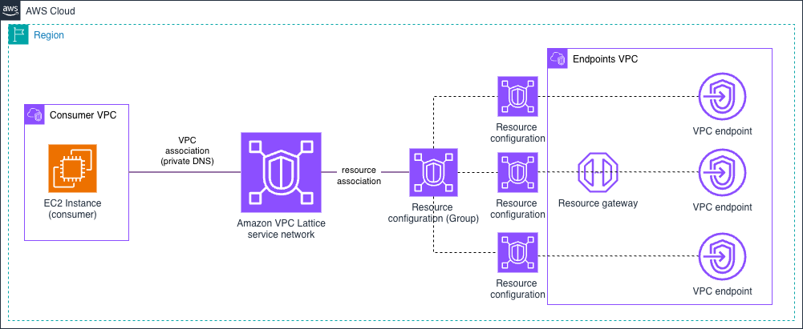

# Amazon VPC Lattice - Centralized VPC Endpoints

This pattern centralizes interface VPC endpoints in a shared **endpoints VPC** and makes them reachable from consumer VPCs through VPC Lattice **VPC Resources** (a resource gateway plus resource configurations). Instead of duplicating interface endpoints in every VPC, consumers can reach AWS services through the centralized endpoints (cutting cost and simplifying endpoint management).

<!-- TODO: add architecture diagram, e.g.  -->

Each AWS service endpoint is fronted by a resource configuration with a **custom domain name** (e.g. `ssm.<region>.amazonaws.com`). Controlled private DNS on the consumer VPC association (scoped to `*.amazonaws.com` only) makes the consumer's normal `ssm.<region>.amazonaws.com` lookup resolve to a VPC Lattice managed address (`129.224.0.x/17`) and route to the central endpoint, with no client configuration changes.

## Why centralize, and why with VPC Lattice

**Centralize vs. decentralize is a tradeoff, not a best practice.** Interface endpoints are billed per endpoint, per AZ, so duplicating them in every VPC adds up. Centralizing them in one shared VPC cuts that cost and gives you a single place to govern and observe endpoint access. The trade-off is a cross-VPC dependency and a shared blast radius; keeping endpoints per-VPC maximizes isolation at higher cost and more management. Choose based on your cost and control priorities, not a rule.

**Why VPC Lattice instead of AWS Transit Gateway or AWS Cloud WAN** for the connectivity:

- **No NAT with overlapping CIDRs**. VPC Lattice brokers the connection, so the consumer and endpoints VPCs can share the same address space with no NAT or re-addressing.
- **Automatic DNS resolution**. Private DNS on the VPC association resolves the normal `<service>.<region>.amazonaws.com` name through VPC Lattice, with no Route 53 private hosted zones or per-consumer DNS plumbing.
- **Central logging**. The service network's access log subscription records every request in one place, however many consumers you associate.

## What gets deployed

| Component | Details |
|-----------|---------|
| **Endpoints VPC** (`10.0.0.0/16`) | Centralized interface VPC endpoints for AWS services (SSM, SSM Messages, EC2 Messages, STS) |
| **Consumer VPC** (`10.0.0.0/16`) | EC2 instances (1 per AZ) consuming AWS services through the centralized endpoints; associated to the service network |
| **VPC Lattice service network** | Service network connecting the consumer VPC to the centralized endpoints |
| **Resource gateway** | Dual-stack resource gateway in the endpoints VPC enabling VPC Lattice to route to the endpoints |
| **Resource configurations** | One configuration per endpoint, each with a custom `*.amazonaws.com` domain name |
| **Resource associations** | One association per configuration to the service network, with private DNS resolution |
| **Access logging** | A CloudWatch Logs log group (`/aws/vpclattice/<identifier>`) and an access log subscription at the service-network scope |

## VPC Lattice resource configuration

This pattern uses VPC Lattice **VPC Resources** (not a service with listeners/target groups):

| Aspect | Configuration |
|--------|---------------|
| **Construct** | Resource gateway + resource configurations + resource associations |
| **Custom Domain Name** | ✅ Yes (`<service>.<region>.amazonaws.com` per endpoint) |
| **Protocol / Port** | TCP on port 443 |
| **Private DNS** | ✅ Enabled, scoped to `*.amazonaws.com` only (`SPECIFIED_DOMAINS_ONLY`) |
| **Resolved address** | VPC Lattice VPC-resource range `129.224.0.x/17` (IPv6 `fd00:ec2:80::/64`) |
| **Targets** | Centralized interface VPC endpoints in the endpoints VPC |

## Implementation

This pattern is available for both IaC tools (CloudFormation + Terraform parity). Each implementation directory has its own README with deployment instructions:

| IaC Tool | Location |
|----------|----------|
| **CloudFormation** | [`./cloudformation/`](./cloudformation/) |
| **Terraform** | [`./terraform/`](./terraform/) |

## Testing Connectivity

After deploying either implementation, you connect to a consumer EC2 instance via Systems Manager, confirm AWS service endpoints resolve through VPC Lattice, and call an AWS API to confirm the request flows through the centralized endpoints — from a consumer VPC with no interface endpoints of its own.

<details>
<summary>Click to expand testing steps</summary>

#### Step 1: Connect to a Consumer Instance via Systems Manager

A successful Session Manager connection already proves the centralized endpoints work — Session Manager requires connectivity to the SSM, SSM Messages, and EC2 Messages endpoints.

> **Note**: Consumer EC2 instance IDs are provided as outputs when deploying the CloudFormation or Terraform code.

```bash
aws ssm start-session --target <consumer-instance-id> --region <your-region>
```

**Expected Result**: Session Manager connects to the instance.

#### Step 2: Verify DNS Resolution for Centralized Endpoints

From the consumer instance, confirm AWS service endpoints resolve to the VPC Lattice VPC-resource range:

```bash
dig +short ssm.<your-region>.amazonaws.com
dig +short ec2messages.<your-region>.amazonaws.com
dig +short sts.<your-region>.amazonaws.com
```

**Expected Result**: addresses in the VPC Lattice VPC-resource range `129.224.0.x/17` (IPv6 `fd00:ec2:80::/64`), indicating VPC Lattice is handling resolution and routing.

```
129.224.0.123
129.224.0.124
```

#### Step 3: Test Endpoint Connectivity

Call an AWS API to confirm traffic reaches the service through the centralized endpoint:

```bash
aws sts get-caller-identity --region <your-region>
```

**Expected Response** (JSON format):
```json
{
    "UserId": "AIDACKCEVSQ6C2EXAMPLE:i-1234567890abcdef0",
    "Account": "123456789012",
    "Arn": "arn:aws:sts::123456789012:assumed-role/ec2-ssm-role-endpoints/i-1234567890abcdef0"
}
```

</details>

## Cleanup

Tear down the resources when you are finished to stop incurring charges. While this pattern is deployed it runs consumer EC2 instances and the centralized interface VPC endpoints, and uses CloudWatch Logs vended-logs pricing for VPC Lattice access logging (ingestion + storage).

Use the teardown command for whichever implementation you deployed:

| IaC Tool | From | Command |
|----------|------|---------|
| **Terraform** | [`./terraform/`](./terraform/) | `terraform destroy` |
| **CloudFormation** | [`./cloudformation/`](./cloudformation/) | `make undeploy` |

The access-logging CloudWatch Logs log group is created and destroyed together with the pattern, so the standard teardown removes it — no manual cleanup is required.

## Next Steps

After successfully deploying this pattern:

1. **Test connectivity**: Follow the testing guide above to verify endpoints work through VPC Lattice.
2. **Add more endpoints**: Extend the `vpc_endpoints` list to centralize additional AWS services.
3. **Scale consumers**: Associate more consumer VPCs to share the centralized endpoints.
4. **Explore other patterns**: Try the [Simple Architectures](../../1-simple_architectures/) target types or [Multi-Account patterns](../../2-multi_account/).
5. **Add access control**: See the [Auth Policies & SigV4](../../4-auth_policies/) pattern to gate access by IAM identity.
